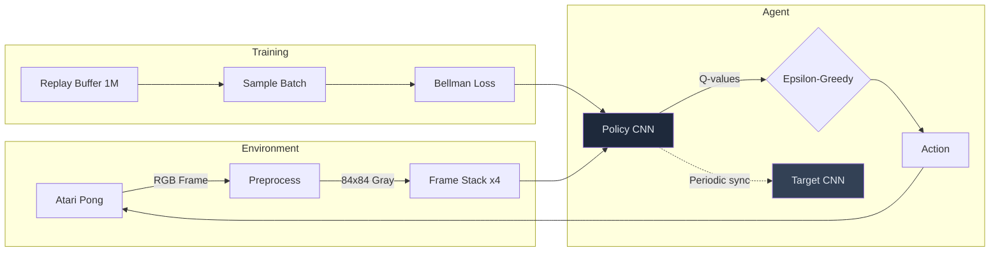

# RL-Pong

Deep Q-Network (DQN) agent trained to play Atari Pong using frame-stacked visual observations, experience replay, and target network stabilization.



## Architecture

| Component | Details |
|-----------|---------|
| **Network** | 3-layer CNN (32→64→64 filters) + 512-unit FC head |
| **Input** | 4 stacked grayscale frames (4 x 84 x 84), normalized to [0, 1] |
| **Replay Buffer** | 1M transitions, uniform random sampling |
| **Target Network** | Hard-synced every 10 episodes |
| **Exploration** | Epsilon-greedy, decaying from 1.0 → 0.1 (factor 0.995/episode) |
| **Parallelism** | 8 vectorized environments via Stable-Baselines3 `DummyVecEnv` |
| **Precision** | Mixed-precision training with `torch.cuda.amp` |

## Features

- **Custom DQN implementation** -- Full PyTorch DQN with convolutional feature extractor, experience replay, and target network
- **Vectorized environments** -- 8 parallel Pong instances for faster experience collection
- **Mixed-precision training** -- AMP + GradScaler for efficient GPU utilization
- **Checkpoint saving** -- Policy net, target net, optimizer state, and reward history persisted after training

## Quick Start

```bash
pip install gym[atari] autorom[accept-rom-license] opencv-python torch stable-baselines3 shimmy
```

Run the notebook `Pong_QL_Ver1.ipynb` in Jupyter or Google Colab.

## Project Structure

```
RL-Pong/
├── Pong_QL_Ver1.ipynb    # Full training pipeline (DQN, replay buffer, training loop)
└── README.md
```

## Tech Stack

| Component | Technology |
|-----------|-----------|
| RL Framework | Custom DQN (PyTorch) |
| Environment | OpenAI Gym (Atari - PongNoFrameskip-v4) |
| Parallelism | Stable-Baselines3 DummyVecEnv |
| Vision | OpenCV (frame preprocessing) |
| Training | PyTorch AMP (mixed precision) |

## License

MIT
